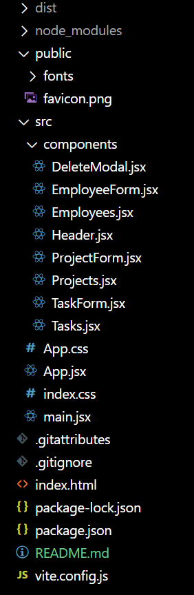

# Task tracker

## Getting started 

In the project directory, you can run:

### `npm run dev`

Runs the app in the development mode.
Open [http://localhost:5173](http://localhost:5173) to view it in your browser.

The page will reload when you make changes.

### `npm run build`

Builds the app for production to the `dist` folder.
It correctly bundles React in production mode and optimizes the build for the best performance.

### Deployed app

Follow this [link](https://deluxe-alfajores-fec3ee.netlify.app/) to see deployed app on Netlify.

## Folder structure overview

The project has a simple folder structure:

### `public`

The `public` folder contains the assets for the application, such as icons and fonts.

### `scr`

The `src` folder contains the `main.jsx` and `App.jsx` files, as well as style files: `index.css` and `App.css`.

On start-up, `main.jsx` renders the `App.jsx`, the file that controls the whole logic of the application and renders other components.

Inside of the `src` folder, there is the `components` folder which contains every component in the application.

`index.css` contains the general styles, while the styles for all components can be found in the `App.css` file.

## Description of functionalities

The app contains three entities: tasks, employees, and projects. The user can define tasks using the `+ NEW TASK` button and assign these tasks to previously defined employees. The employees can be added to the app by using the `+ NEW EMPLOYEE` button. Projects can be used to group tasks by projects and track the percentage of completed tasks by projects. New projects can be defined by using the `+ NEW PROJECT` button. The user can edit, read, and delete all previously defined tasks, employees, and projects.

The app will notify the user if the task is overdue or if a task has not been assigned to any of the employees by displaying messages next to the title of the problematic task.

The app will display the best-ranked employees (by number of completed tasks) at the top of the page. as well as the overall percentage of completed tasks.

When a task has been marked completed by the user, the app will update the percentage of completed tasks on the project containing said task and sort all tasks so that all unfinished tasks are at the top of the list. The app will update the number of completed tasks by the employee who was assigned the task and update the "Top 5" list. Similarly, in the projects section of the app, all finished projects will be moved to the bottom of the list.

I have decided to implement Projects as a third entity so that the user could define complex projects that have simple, more manageable tasks assigned to different employees. Also, I have added the overall percentage of completed tasks as an additional statistic because I believe that this app would probably be used by people working in a managerial role and that such information would be useful to them.
